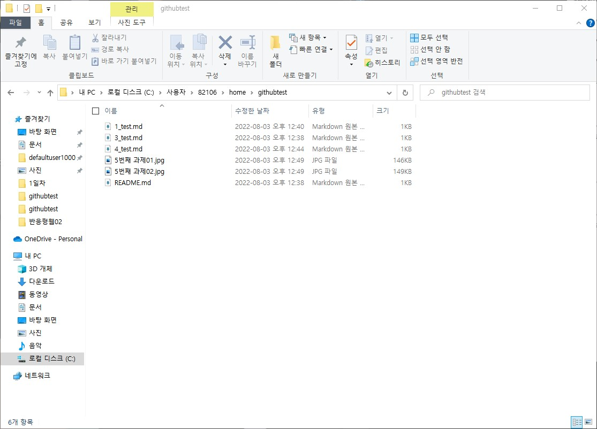

# 황지현 git hub 과제
> 2020.08.03
## (01~03) 과제
1) Github에 프로젝트 생성 —> 프로젝트이름은 각자 정함
2) 사용자 홈 폴더 안에 school 이라는 이름의 폴더를 만들고 그 안에서 clone받기
3) clone받은 프로젝트 안에서 임의의 파일을 3개 이상 생성하고 push

## (04) 과제
4) 사용자 홈 폴더 안에 home이라는 이름의 폴더를 만들고 새롭게 clone받기

## (05)과제
5) home안에 받은 내용에 하나의 파일은 수정, 하나의 파일은 삭제, 새로운 파일 하나 추가 -> push

